Introduction
------------

Facebook is the most popular social network worldwide with close to 2 billion monthly active users. It contains a large amount of data about users and their behavior. Moreover, Facebook serves as an advertising platform and its targeted adverts can reach a large amount of users. Monitoring the activity of users on Facebook can help brands identify the trends in user behavior and use this information as a competitive advantage. Also, communicating with customers via social media provides an amazing opportunity for brands to connect with their customers, gain valuable feedback and build awareness. Therefore, it is important to create content that has a significant impact on users and encourages them to engage with the brand - through liking, commenting and sharing. Prediction of this impact can help brands create messages that have desired effect on users, which can lead to improvement of their social media image.

Data Set
--------

The client is an Australian cosmetics company called Australis Cosmetics. The data set analysed in this project was acquired from Australis Cosmetics Facebook Page. At the time of creating the data set, over 211,000 users 'liked' the Australis Cosmetics Facebook Page. The posts received over 225,000 likes, 33,000 comments, 7,600 shares and 1,600 reactions.

### User Data

Demographic data that Facebook Page owners can access through Facebook Insights provides information such as gender, age and location. Demographic data of users who like a particular Facebook Page used to be available but is not available anymore. Therefore it was not possible to access user data for this project.

### Page Data

Rfacebook package used to acquire the data set for this project provides and interface to an Facebook API. After getting the User Access Token from Graph API Explorer, Facebook data can be accessed.

``` r
#loading Rfacebook library
library(Rfacebook)
token <- 'XXXXX'
```

The data set consists of a data frame containing a list of all posts posted on Australis Cosmetics Facebook page. This was achieved using the `getPage()` function. Important information in the data set are the text of the post (message), time when the post was created (created\_time), type of the post (type), counts of likes, comments and shares (likes\_count, comments\_count and shares\_count). For posts created in 2016 and later, the `reactions` argument of the `getPage()` function also provided count of all reactions of the posts (Love, Haha, Wow, Sad and Angry).

``` r
#getting posts from Facebook using Page ID
australis_raw <- getPage(183675737042, token, n=5000, reactions = TRUE)
#setting 'id' column as the first column in the data frame
id <- australis_raw$id[1]
```

Comment messages were acquired using the `getPost()` function for each post, using `id` to match the post with its comments.

``` r
com <- list()
for (i in 1:length(australis_raw$id)){
  com[[i]] <- getPost(post=australis_raw$id[i], token, comments = TRUE, likes = FALSE)
}
```

Finally, comments were appended at the end of the `australis` data frame.

``` r
for(i in 1:length(com)){
  australis_raw$comments[i] <- paste(com[[i]]$comments$message,collapse=" ")
}
```

The original file is saved as .csv file.

``` r
australis_raw = write.csv("australis_raw.csv")
```

Data Cleaning
-------------

The data set required only few minor transformations. It was necessary to remove the first ten rows of the data set that contained 'Life events' with no text of the post. Also, the time format in the created\_time column needed to be edited. Time zone has been changed to Australian Eastern Daylight Time and three other columns were created that will be used in analysis. These columns are weekday - containing days of the week when the post was posted, month - containing the months and hour - a column containing the hour of when the post was posted.

``` r
#loading the file into a data frame
australis_raw = read.csv("australis_raw.csv")

#creating a subset and removing the first 10 rows that contain 'life events'
australis_raw <- subset(australis_raw[11:2054,])

library(lubridate)
#changing time format
australis_raw$created_time <- as.POSIXct(australis_raw$created_time, format = "%Y-%m-%dT%H:%M:%S+0000", tz ="GMT")

#changing the time zone 
attr(australis_raw$created_time, "tzone") <- "Australia/Sydney"

#saving the file
write.csv(australis_raw, "australis.csv")
```

Exploratory Analysis
--------------------

In this section, the data set will be analysed and the results will be visualized using `ggplot2` package and base plots.

The first three plots show the distribution of likes, comments and shares over time since the creation of the page.

``` r
australis = read.csv("australis.csv")

library(ggplot2)
#likes/shares/comments count and created time 
australis$created_time <- as.Date(australis$created_time)
ggplot(australis, aes(x=australis$created_time, y=australis$likes_count)) +
  geom_point(color = "blue", alpha = 0.3) +
  labs(x = "created time", y = "likes count") +
  scale_x_date(date_labels = "%Y") +
  ggtitle("The distribution of likes since the creation of the page") +
  theme_bw()

ggplot(australis, aes(x=australis$created_time, y=australis$comments_count)) +
  geom_point(color = "green", alpha = 0.3)  +
  labs(x = "created time", y = "comments count") +
  scale_x_date(date_labels = "%Y") +
  ggtitle("The distribution of comments since the creation of the page") +
  theme_bw()

ggplot(australis, aes(x=australis$created_time, y=australis$shares_count)) +
  geom_point(color = "red", alpha = 0.3)  +
  labs(x = "created time", y = "shares count") +
  scale_x_date(date_labels = "%Y") +
  ggtitle("The distribution of shares since the creation of the page") +
  theme_bw()
```

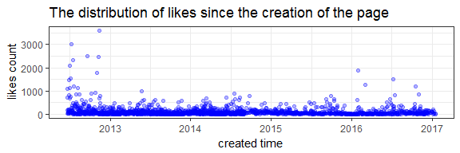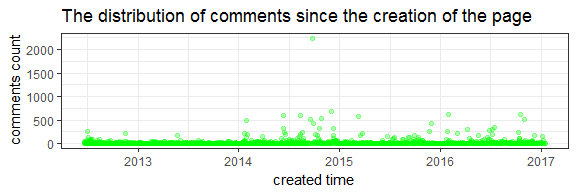

The distribution of the reactions Australis Cosmetics page received shows that the largest potion of reactions is made up of 'love' reactions, followed by 'wow'. On the other hand, the amount of 'sad' and 'angry' is very small.

``` r
#sums of reaction counts
love <- sum(australis$love_count, na.rm=TRUE)
haha <- sum(australis$haha_count, na.rm=TRUE)
wow <- sum(australis$wow_count, na.rm=TRUE)
sad <- sum(australis$sad_count, na.rm=TRUE)
angry <- sum(australis$angry_count, na.rm=TRUE)

#creating a data frame
df_reactions <- data.frame(
  reactions = c("love","haha","wow","sad","angry"),
  value = c(love, haha, wow, sad, angry)
)
#creating a pie chart
bp_reactions <- ggplot(df_reactions, aes(x="", y=value, fill=reactions))+
  geom_bar(width = 1, stat = "identity")
pie <- bp_reactions + coord_polar("y", start=0)
pie <- pie + theme_minimal() + ggtitle("The distribution of reactions the page received") 
pie <- pie + xlab(NULL) + ylab(NULL)
pie
```

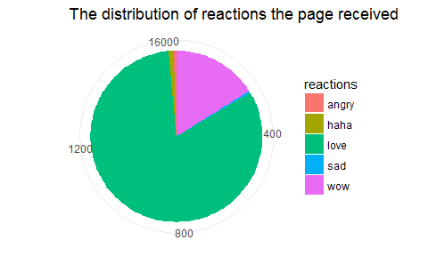

Most of the posts on the page include a photo and therefore the most common type of post is 'photo'.

``` r
barplot(prop.table(table(australis$type)), col = c("palegreen2", "plum2", "skyblue2", "salmon2"), border = NA, space = 0.1, main = "Types of posts")
```

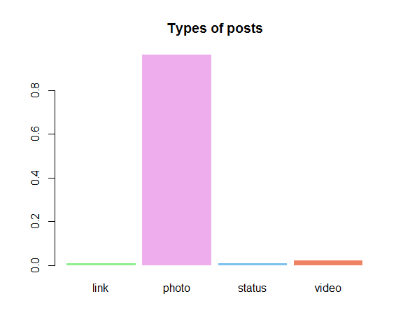

Consequently, 'photo' as a type of posts received the highest number of likes, comments and shares.

``` r
#likes per type of post
ggplot(australis, aes(x=australis$type, y=australis$likes_count)) +
  geom_point(color = "purple", alpha = 0.3) +
  labs(x = "type of post", y = "likes count")+
  ggtitle("Distribution of likes per type of post") +
  theme_bw()

#comments per type of post
ggplot(australis, aes(x=australis$type, y=australis$comments_count)) +
  geom_point(color = "brown", alpha = 0.3) +
  labs(x = "type of post", y = "comments count")+
  ggtitle("Distribution of comments per type of post") +
  theme_bw()

#shares per type of post
ggplot(australis, aes(x=australis$type, y=australis$shares_count)) +
  geom_point(color = "black", alpha = 0.3) +
  labs(x = "type of post", y = "shares count")+
  ggtitle("Distribution of shares per type of post") +
  theme_bw()
```

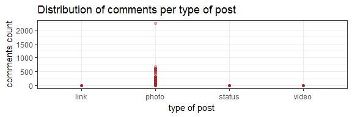

Most posts were posted in the afternoon and in the morning. Smaller portion of posts were posted in the evening and very few were posted at night.

``` r
australis = read.csv("australis.csv")
library(lubridate)

australis$hour <- lubridate::hour(australis$created_time)
#dividing days into sections
day_breaks <- hour(hm("00:00", "6:00", "12:00", "18:00", "23:59"))
day_labels <- c("Night", "Morning", "Afternoon", "Evening")
day_sections <- cut(x=australis$hour, breaks=day_breaks, labels=day_labels, include.lowest=TRUE)

#bar plot of posts by day section
barplot(prop.table(table(day_sections)), col = c("sky blue", "pink", "green", "magenta"), border = NA, space = 0.1, main = "The time of creating the posts divided into day sections")
```

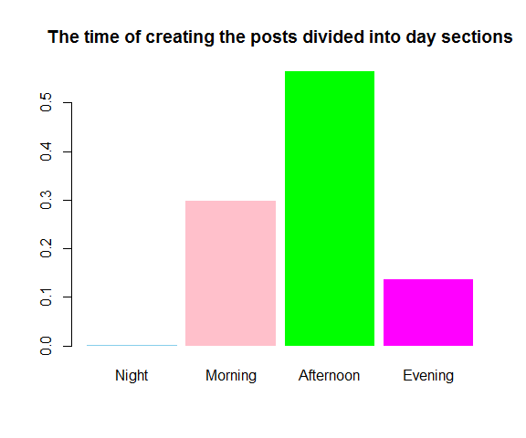

The amount of posts during the work days is very similar for each day with slightly higher number of posts on Friday. The amount of posts posted during the weekend is significantly lower.

``` r
library(lubridate)
australis$weekday <- wday(australis$created_time, label = TRUE)
barplot(prop.table(table(australis$weekday)), col = c("aquamarine3", "antiquewhite3", "coral1", "steelblue1", "brown1", "darkseagreen3", "goldenrod2"),  border = NA, space = 0.1, main = "The time of creating the posts divided into days of the week")
```

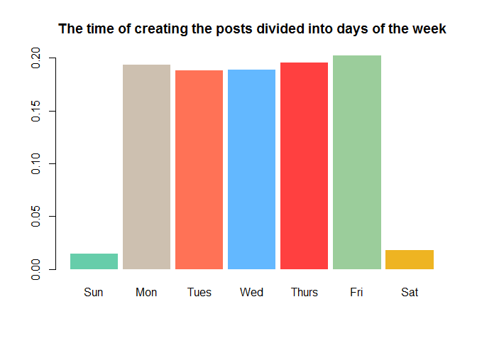

Posts posted in the afternoon received the most likes, which is not surprising because more than a half of posts were posted in the afternoon. Posts posted in the morning received more than a quarter of all likes and posts posted in the evening received a smaller amount of likes.

``` r
australis = read.csv("australis.csv")
library(lubridate)

australis$hour <- lubridate::hour(australis$created_time)

#dividing days into sections
day_breaks <- hour(hm("00:00", "6:00", "12:00", "18:00", "23:59"))
day_labels <- c("Night", "Morning", "Afternoon", "Evening")
day_sections <- cut(x=australis$hour, breaks=day_breaks, labels=day_labels, include.lowest=TRUE)

#creating a vector for each day section
nightlikesvec <- grep("Night", day_sections, value = FALSE)
nightlikes <- sum(australis$likes_count[nightlikesvec])
morninglikesvec <- grep("Morning", day_sections, value = FALSE)
morninglikes <- sum(australis$likes_count[morninglikesvec])
afternoonlikesvec <- grep("Afternoon", day_sections, value = FALSE)
afternoonlikes <- sum(australis$likes_count[afternoonlikesvec])
eveninglikesvec <- grep("Evening", day_sections, value = FALSE)
eveninglikes <- sum(australis$likes_count[eveninglikesvec])

#creating a data frame
df_dayseclikes <- data.frame(
  dayseclikes = c("night","morning","afternoon","evening"),
  value = c(nightlikes, morninglikes, afternoonlikes, eveninglikes)
)
#creating a pie chart
library(ggplot2)
bp_dayseclikes <- ggplot(df_dayseclikes, aes(x="", y=value, fill=dayseclikes))+
  geom_bar(width = 1, stat = "identity")
pie2 <- bp_dayseclikes + coord_polar("y", start=0)
pie2 <- pie2 + theme_minimal() + ggtitle("The proportion of likes of posts divided by day section")
pie2 <- pie2 + scale_fill_discrete(name = "day section") 
pie2 <- pie2 + xlab(NULL) + ylab(NULL)
pie2
```

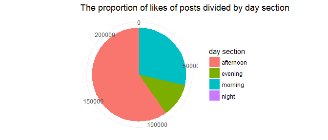

Posts posted in the afternoon also received more than a half of all comments. Posts posted in the evening received about a quarter and posts posted in the morning received slightly smaller amount of the comments.

``` r
australis = read.csv("australis.csv")
library(lubridate)
australis$hour <- lubridate::hour(australis$created_time)

#dividing days into sections
day_breaks <- hour(hm("00:00", "6:00", "12:00", "18:00", "23:59"))
day_labels <- c("Night", "Morning", "Afternoon", "Evening")
day_sections <- cut(x=australis$hour, breaks=day_breaks, labels=day_labels, include.lowest=TRUE)

#creating a vector consisting of sums of comments per day section
nightcomvec <- grep("Night", day_sections, value = FALSE)
nightcom <- sum(australis$comments_count[nightcomvec])
morningcomvec <- grep("Morning", day_sections, value = FALSE)
morningcom <- sum(australis$comments_count[morningcomvec])
afternooncomvec <- grep("Afternoon", day_sections, value = FALSE)
afternooncom <- sum(australis$comments_count[afternooncomvec])
eveningcomvec <- grep("Evening", day_sections, value = FALSE)
eveningcom <- sum(australis$comments_count[eveningcomvec])

#creating a data frame
df_dayseccom <- data.frame(
  dayseccom = c("night","morning","afternoon","evening"),
  value = c(nightcom, morningcom, afternooncom, eveningcom)
)
#creating a pie chart
bp_dayseccom <- ggplot(df_dayseccom, aes(x="", y=value, fill=dayseccom))+
  geom_bar(width = 1, stat = "identity")
piecom <- bp_dayseccom + coord_polar("y", start=0)
piecom <- piecom + theme_minimal() + ggtitle("The proportion of comments of posts divided by day section")
piecom <- piecom + scale_fill_discrete(name = "day section")
piecom <- piecom + xlab(NULL) + ylab(NULL)
piecom
```

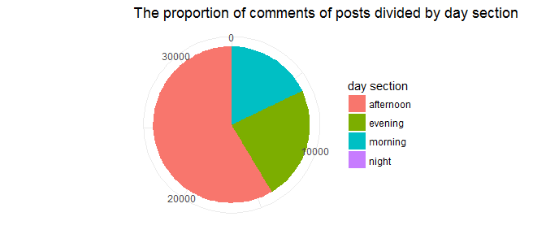

Posts posted in the afternoon were shared the most. Posts posted in the morning received more than a quarter of all shares and posts posted in the evening received a smaller amount of shares.

``` r
australis = read.csv("australis.csv")
library(lubridate)
australis$hour <- lubridate::hour(australis$created_time)

#dividing days into sections
day_breaks <- hour(hm("00:00", "6:00", "12:00", "18:00", "23:59"))
day_labels <- c("Night", "Morning", "Afternoon", "Evening")
day_sections <- cut(x=australis$hour, breaks=day_breaks, labels=day_labels, include.lowest=TRUE)

#creating a vector consisting of sums of shares per day section
nightshvec <- grep("Night", day_sections, value = FALSE)
nightsh <- sum(australis$shares_count[nightshvec])
morningshvec <- grep("Morning", day_sections, value = FALSE)
morningsh <- sum(australis$shares_count[morningshvec])
afternoonshvec <- grep("Afternoon", day_sections, value = FALSE)
afternoonsh <- sum(australis$shares_count[afternoonshvec])
eveningshvec <- grep("Evening", day_sections, value = FALSE)
eveningsh <- sum(australis$shares_count[eveningshvec])

#creating a data frame
df_daysecsh <- data.frame(
  daysecsh = c("night","morning","afternoon","evening"),
  value = c(nightsh, morningsh, afternoonsh, eveningsh)
)
#creating a pie chart
bp_daysecsh <- ggplot(df_daysecsh, aes(x="", y=value, fill=daysecsh))+
  geom_bar(width = 1, stat = "identity")
piesh <- bp_daysecsh + coord_polar("y", start=0)
piesh <- piesh + theme_minimal() + ggtitle("The proportion of shares of posts divided by day section")
piesh <- piesh + scale_fill_discrete(name = "day section")
piesh <- piesh + xlab(NULL) + ylab(NULL)
piesh
```

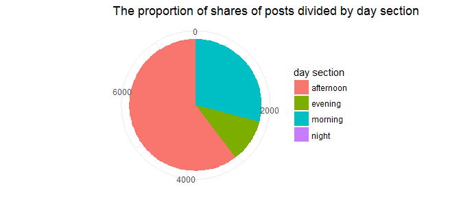

The total number of likes per work days is evenly distributed and the amount of likes per post posted during the weekend is lower.

``` r
library(lubridate)
australis$weekday <- wday(australis$created_time, label = TRUE)

#creating a vector consisting of sums of likes per weekday
monlikesvec <- grep("Mon", australis$weekday, value = FALSE)
monlikes <- sum(australis$likes_count[monlikesvec])
tuelikesvec <- grep("Tues", australis$weekday, value = FALSE)
tuelikes <- sum(australis$likes_count[tuelikesvec])
wedlikesvec <- grep("Wed", australis$weekday, value = FALSE)
wedlikes <- sum(australis$likes_count[wedlikesvec])
thulikesvec <- grep("Thurs", australis$weekday, value = FALSE)
thulikes <- sum(australis$likes_count[thulikesvec])
frilikesvec <- grep("Fri", australis$weekday, value = FALSE)
frilikes <- sum(australis$likes_count[frilikesvec])
satlikesvec <- grep("Sat", australis$weekday, value = FALSE)
satlikes <- sum(australis$likes_count[satlikesvec])
sunlikesvec <- grep("Sun", australis$weekday, value = FALSE)
sunlikes <- sum(australis$likes_count[sunlikesvec])

#creating a data frame
df_weekdaylikes <- data.frame(
  weekdaylikes = c("Monday","Tuesday","Wednesday","Thursday", "Friday", "Saturday", "Sunday"),
  value = c(monlikes, tuelikes, wedlikes, thulikes, frilikes, satlikes, sunlikes)
)
#creating a pie chart
bp_weekdaylikes <- ggplot(df_weekdaylikes, aes(x="", y=value, fill=weekdaylikes))+
  geom_bar(width = 1, stat = "identity")
pie3 <- bp_weekdaylikes + coord_polar("y", start=0)
pie3 <- pie3 + theme_minimal() + ggtitle("The proportion of likes of posts posted per weekday")
pie3 <- pie3 + scale_fill_discrete(name = "weekday")
pie3 <- pie3 + xlab(NULL) + ylab(NULL)
pie3
```

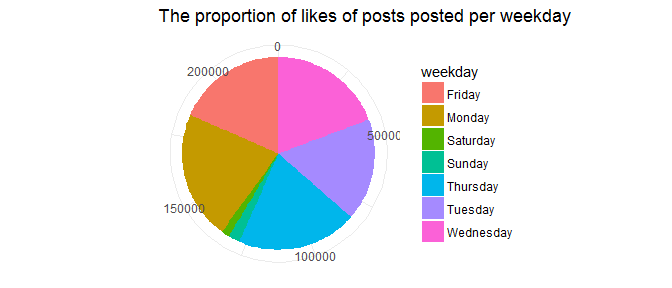

The distribution of comments during weekdays is similar to the distribution of likes.

``` r
library(lubridate)
australis$weekday <- wday(australis$created_time, label = TRUE)

#creating a vector consisting of sums of comments per weekday
moncomvec <- grep("Mon", australis$weekday, value = FALSE)
moncom <- sum(australis$comments_count[moncomvec])
tuecomvec <- grep("Tues", australis$weekday, value = FALSE)
tuecom <- sum(australis$comments_count[tuecomvec])
wedcomvec <- grep("Wed", australis$weekday, value = FALSE)
wedcom <- sum(australis$comments_count[wedcomvec])
thucomvec <- grep("Thurs", australis$weekday, value = FALSE)
thucom <- sum(australis$comments_count[thucomvec])
fricomvec <- grep("Fri", australis$weekday, value = FALSE)
fricom <- sum(australis$comments_count[fricomvec])
satcomvec <- grep("Sat", australis$weekday, value = FALSE)
satcom <- sum(australis$comments_count[satcomvec])
suncomvec <- grep("Sun", australis$weekday, value = FALSE)
suncom <- sum(australis$comments_count[suncomvec])

#creating a data frame
df_weekdaycom <- data.frame(
  weekdaycom = c("Monday","Tuesday","Wednesday","Thursday", "Friday", "Saturday", "Sunday"),
  value = c(moncom, tuecom, wedcom, thucom, fricom, satcom, suncom)
)
#creating a pie chart
bp_weekdaycom <- ggplot(df_weekdaycom, aes(x="", y=value, fill=weekdaycom))+
  geom_bar(width = 1, stat = "identity")
pie4 <- bp_weekdaycom + coord_polar("y", start=0)
pie4 <- pie4 + theme_minimal() + ggtitle("The proportion of comments of posts posted per weekday")
pie4 <- pie4 + scale_fill_discrete(name = "weekday")
pie4 <- pie4 + xlab(NULL) + ylab(NULL)
pie4
```

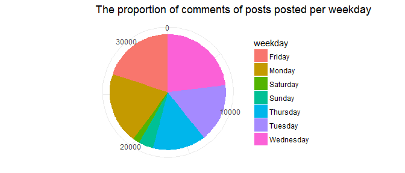

The distribution of shares during weekdays is similar to the distribution of likes and comments.

``` r
library(lubridate)
australis$weekday <- wday(australis$created_time, label = TRUE)

#creating a vector consisting of sums of shares per weekday
monshvec <- grep("Mon", australis$weekday, value = FALSE)
monsh <- sum(australis$shares_count[monshvec])
tueshvec <- grep("Tues", australis$weekday, value = FALSE)
tuesh <- sum(australis$shares_count[tueshvec])
wedshvec <- grep("Wed", australis$weekday, value = FALSE)
wedsh <- sum(australis$shares_count[wedshvec])
thushvec <- grep("Thurs", australis$weekday, value = FALSE)
thush <- sum(australis$shares_count[thushvec])
frishvec <- grep("Fri", australis$weekday, value = FALSE)
frish <- sum(australis$shares_count[frishvec])
satshvec <- grep("Sat", australis$weekday, value = FALSE)
satsh <- sum(australis$shares_count[satshvec])
sunshvec <- grep("Sun", australis$weekday, value = FALSE)
sunsh <- sum(australis$shares_count[sunshvec])

#creating a data frame
df_weekdaysh <- data.frame(
  weekdaysh = c("Monday","Tuesday","Wednesday","Thursday", "Friday", "Saturday", "Sunday"),
  value = c(monsh, tuesh, wedsh, thush, frish, satsh, sunsh)
)
#creating a pie chart
bp_weekdaysh <- ggplot(df_weekdaysh, aes(x="", y=value, fill=weekdaysh))+
  geom_bar(width = 1, stat = "identity")
pie5 <- bp_weekdaysh + coord_polar("y", start=0)
pie5 <- pie5 + theme_minimal() + ggtitle("The proportion of shares of posts posted per weekday")
pie5 <- pie5 + scale_fill_discrete(name = "weekday")
pie5 <- pie5 + xlab(NULL) + ylab(NULL)
pie5
```


Sentiment Analysis
------------------

Media monitoring allows companies to gain valuable information about public opinion on specific topics. Sentiment analysis is a process that can help to understand the opinions and attitudes of the customers of Australis Cosmetics who engage with the company Facebook.

Semantic analysis was also used to create a metric for numerically assessing the emotional tone of the posts and comments. This quantitative metric enables comparison of the posts and observation of how page users react to varying values of positive and negative sentiment. The sentiment in comments can say a lot about how page users feel about the brand which may impact their buying behavior.

`AFINN`, `bing` and `nrc` lexicons provide various ways of classifying and evaluating the sentiment of a sequence of words, which will be discussed in more detail later. However, none of these lexicons is specifically tailored to cosmetics industry which may result in incorrect classification of certain words. Consequently, understanding the context of the analysis is very important when interpreting the results.

Tidytext package and Text Mining with R tutorial (<http://tidytextmining.com/>) was used to perform the sentiment analysis of the posts and comments on Australis Cosmetics Facebook Page.

First, it was necessary to convert the data frame to tidy text format - a table with one-term-per-row for both posts and comments.

``` r
#changing message and comment columns from factor to character type
australis$message <- as.character(australis$message)
australis$comments <- as.character(australis$comments)

post <- australis$message
comment <- australis$comments

#transforming to data frames
post_df <- data_frame(line = 11:2054,  text = post)
comment_df <- data_frame(line = 11:2054,  text = comment)

#breaking up text into individual tokens - single words
posts_un <- post_df %>%
  unnest_tokens(word, text)
comments_un <- comment_df %>%
  unnest_tokens(word, text)
```

Stop words were removed using `anti_join` function.

``` r
#removing stop words
posts1 <- posts_un[,2]
comments1 <- comments_un[,2]
stopwords <- as.vector(stop_words[,1])
cleanpost <- anti_join(posts1, stopwords, by = "word")
cleancom <- anti_join(comments1, stopwords, by = "word")
```

The posts and comments included many links so expressions as 'http' and 'bit.ly' that appeared frequently were removed. Expressions 'australis' and 'online' were removed as well. After that, the expressions containing digits were removed as well and the data frames for posts and comments were created.

``` r
#cleaning expressions 
cleanpost2 <- subset(cleanpost, cleanpost$word!="http" & cleanpost$word!="bit.ly" & cleanpost$word!="australis" & cleanpost$word!="online")
cleancom2 <- subset(cleancom, cleancom$word!="http" & cleancom$word!="bit.ly" & cleancom$word!="australis")

#removing digits
posts <- gsub('[[:digit:]]+', '', cleanpost2$word)
comments <- gsub('[[:digit:]]+', '', cleancom2$word)

#creating data frames
posts <- as.data.frame(posts)
comments <- as.data.frame(comments)
```

Using the `tm` package. the `posts` and `comments` data frames were converted to `Document Term Matrx`(dtm) Dtm was used to calculate the frequency of how often the words appear in the data frames. 20 most frequently occurring words were saved and will be used to plot the data.

``` r
library(tm)

#using posts data frame to create document term matrix 
corppst <- Corpus(VectorSource(posts))
dtmpst <- DocumentTermMatrix(corppst)

#finding most frequently occuring words
freqpst <- sort(colSums(as.matrix(dtmpst)), decreasing=TRUE)   
freqpst_df <- as.data.frame(freqpst)

#using comments data frame to create document term matrix 
corpc <- Corpus(VectorSource(comments))
dtmc <- DocumentTermMatrix(corpc)

#finding most frequently occuring words
freqc <- sort(colSums(as.matrix(dtmc)), decreasing=TRUE)   
freqc_df <- as.data.frame(freqc)

#saving 20 words that appear most frequently in each data frame
smallfreqpost_df <- as.data.frame(head(freqpst, 20))
smallfreqc_df <- as.data.frame(head(freqc, 20))
```

Before plotting the data, the data frames were edited using `data.table` package and the column names were changed.

``` r
library(data.table)

freqpst_tb <- setDT(smallfreqpost_df, keep.rownames = TRUE)[]
colnames(freqpst_tb) <- c("word", "frq")

freqc_tb <- setDT(smallfreqc_df, keep.rownames = TRUE)[]
colnames(freqc_tb) <- c("word", "frq")
```

The order of words is set to be same as in the data frame and a bar plot is created using `ggplot2` package.

``` r
#word column ordered as in data frame
freqpst_tb$word <- factor(freqpst_tb$word, levels=unique(as.character(freqpst_tb$word)))

#creating a plot for the most frequent words in posts data frame
freqplot <- 
  ggplot(freqpst_tb, aes(freqpst_tb$word, freqpst_tb$frq)) +
  geom_bar(width = .7, fill="salmon3", stat = "identity") +
  xlab(NULL) +
  ylab("frequency") +
  theme_light() 
freqplot

#word column ordered as in data frame
freqc_tb$word <- factor(freqc_tb$word, levels=unique(as.character(freqc_tb$word)))

#creating a plot for the most frequent words in comments data frame
freqplot2 <- 
  ggplot(freqc_tb, aes(freqc_tb$word, freqc_tb$frq)) +
  geom_bar(width = .7, fill="plum2", stat = "identity") +
  xlab(NULL) +
  ylab("frequency") +
  theme_light()
freqplot2
```

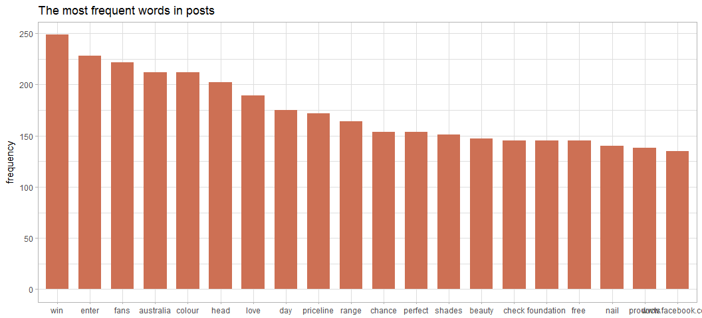

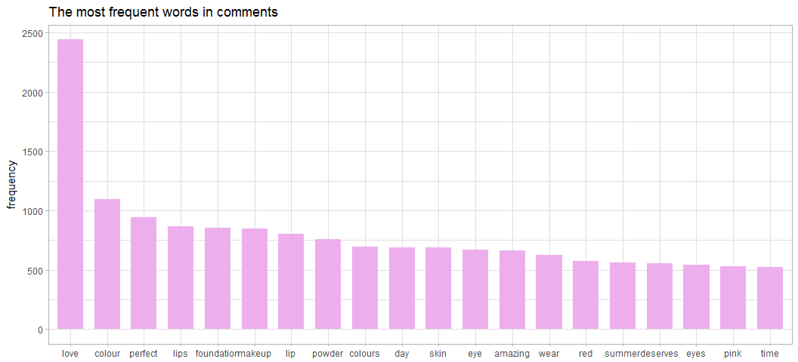

### Sentiment in Posts and Comments

Sentiment in posts and comments was evaluated using lexicons included in the `tidytext`package.

The lexicons are based on unigrams - single words. The `bing` lexicon divides words into positive and negative. The `AFINN` lexicon gives each word a score between -5 (negative sentiment) and 5 (positive sentiment). The `nrc` lexicon contains words divided according to emotions - positive, negative, anger, anticipation, disgust, fear, joy, sadness, surprise, and trust.

The one-term-per-row tables for posts and comments were created first. These were joined with the `AFINN` lexicon and each word received a score. The results were grouped by line and the sentiment scores for each post were created.

``` r
#creating a one-term-per-row table for posts
posts_s <- post_df %>%
  unnest_tokens(word, text)

#getting afinn sentiment
afinn <- posts_s %>% 
  inner_join(get_sentiments("afinn"), by = "word") %>% 
  group_by(index = line) %>% 
  summarise(sentiment = sum(score)) %>% 
  mutate(method = "AFINN")

#creating a one-term-per-row table for comments
comments_s <- comment_df %>%
  unnest_tokens(word, text)

#getting afinn sentiment
afinn1 <- comments_s %>% 
  inner_join(get_sentiments("afinn"), by = "word") %>% 
  group_by(index = line) %>% 
  summarise(sentiment = sum(score)) %>% 
  mutate(method = "AFINN")
```

The process for getting the sentiment using `bing` and `nrc` lexicons was similar. One-term-per-row tables were joined with the lexicon, the score for each line was calculated and the final sentiment is the difference between the positive and the negative sentiment.

``` r
#getting bing and nrc sentiment for posts
bing_and_nrc <- bind_rows(posts_s %>% 
                            inner_join(get_sentiments("bing"), by = "word") %>%
                            mutate(method = "Bing et al."),
                          posts_s %>% 
                            inner_join(get_sentiments("nrc"), by = "word") %>% 
                            mutate(method = "NRC")) %>%
  count(method, index = line, sentiment) %>%
  spread(sentiment, n, fill = 0) %>%
  mutate(sentiment = positive - negative)

#getting bing and nrc sentiment for comments
bing_and_nrc1 <- bind_rows(comments_s %>% 
                            inner_join(get_sentiments("bing"), by = "word") %>%
                            mutate(method = "Bing et al."),
                          comments_s %>% 
                            inner_join(get_sentiments("nrc"), by = "word") %>% 
                            mutate(method = "NRC")) %>%
  count(method, index = line, sentiment) %>%
  spread(sentiment, n, fill = 0) %>%
  mutate(sentiment = positive - negative)
```

The plots for sentiments were created using `ggplot2` package.

``` r
#plotting the sentiments for posts
bind_rows(afinn, 
          bing_and_nrc) %>%
  ggplot(aes(index, sentiment, fill = method)) +
  geom_bar(stat = "identity", show.legend = FALSE) +
  facet_wrap(~method, ncol = 1, scales = "free_y")

#plotting the sentiments for comments
bind_rows(afinn1, 
          bing_and_nrc1) %>%
  ggplot(aes(index, sentiment, fill = method)) +
  geom_bar(stat = "identity", show.legend = FALSE) +
  facet_wrap(~method, ncol = 1, scales = "free_y")
```

Judging from the plots, all lexicons provide similar results. Sentiment in the posts was more positive, however there are some posts with negative sentiment. On the other hand, sentiment in the comments seems to be mainly positive, with only few exceptions. This shows that the brand is getting largely positive feedback from its fans on Facebook. Sentiment in the comments associated with some of the posts also received much higher positive score than the rest. These posts should be investigated more closely.

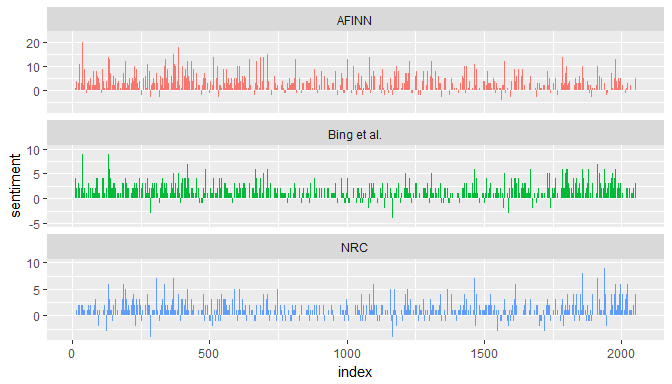

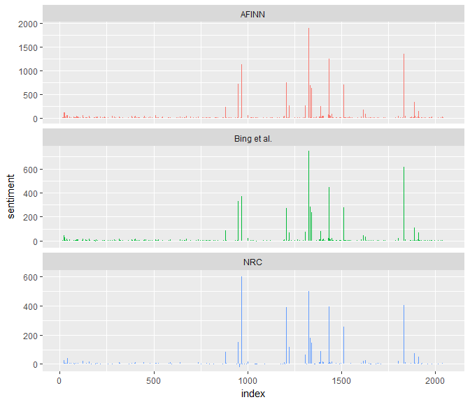

The `bing` lexicon was also used to select the top 10 words that most contribute to both positive and negative sentiment in posts and comments. The words that most contribute to sentiment in posts and comments are similar which suggests that the brand and the fans are using similar language which improves communication. However, considering the context, expressions such as matte or dark might not have negative connotation when talking about make-up.

``` r
#getting sentiment for posts using bing lexicon
postscount <- posts_s %>%
  inner_join(get_sentiments("bing"), by = "word") %>%
  count(word, sentiment, sort = TRUE) %>%
  ungroup()

#getting sentiment for comments using bing lexicon
comcount <- comments_s %>%
  inner_join(get_sentiments("bing"), by = "word") %>%
  count(word, sentiment, sort = TRUE) %>%
  ungroup()

#plotting top 10 positive and negative words in posts that contribute most to sentiment
postscount %>%
  group_by(sentiment) %>%
  top_n(10) %>%
  mutate(word = reorder(word, n)) %>%
  ggplot(aes(word, n, fill = sentiment)) +
  geom_bar(stat = "identity", show.legend = FALSE) +
  facet_wrap(~sentiment, scales = "free_y") +
  labs(y = "Contribution to sentiment",
       x = NULL) +
  coord_flip()

#plotting top 10 positive and negative words in comments that contribute most to sentiment
comcount %>%
  group_by(sentiment) %>%
  top_n(10) %>%
  mutate(word = reorder(word, n)) %>%
  ggplot(aes(word, n, fill = sentiment)) +
  geom_bar(stat = "identity", show.legend = FALSE) +
  facet_wrap(~sentiment, scales = "free_y") +
  labs(y = "Contribution to sentiment",
       x = NULL) +
  coord_flip()
```

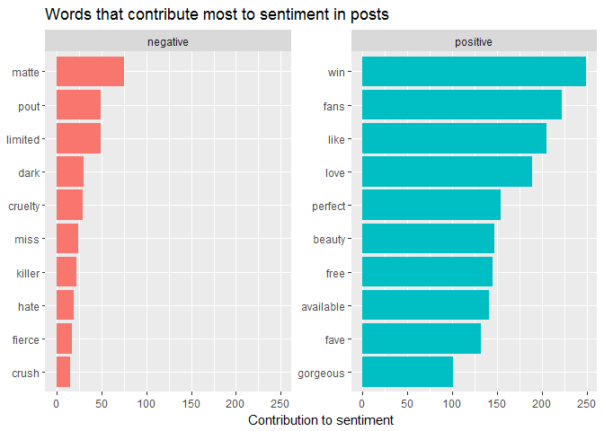

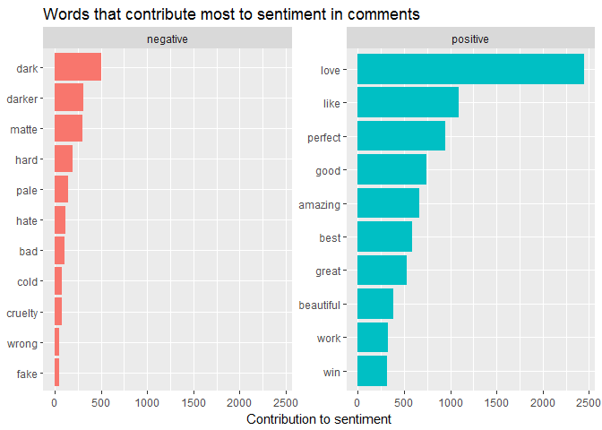

The `reshape2` and `wordcloud` packages was used to visualize the most used words divided into positive and negative words using the `bing` lexicon. The frequency was calculated and most common words were used to create a word cloud.

``` r
#getting the sentiment of posts using bing lexicon
posts_s %>%
  inner_join(get_sentiments("bing"), by = "word") %>%
  count(word, sentiment, sort = TRUE) %>%
  acast(word ~ sentiment, value.var = "n", fill = 0) %>%
  comparison.cloud(colors = c("#F8766D", "#00BFC4"),
                   max.words = 80)

#getting the sentiment of comments using bing lexicon
comments_s %>%
  inner_join(get_sentiments("bing"), by = "word") %>%
  count(word, sentiment, sort = TRUE) %>%
  acast(word ~ sentiment, value.var = "n", fill = 0) %>%
  comparison.cloud(colors = c("#F8766D", "#00BFC4"),
                   max.words = 80)
```

Word cloud for posts.

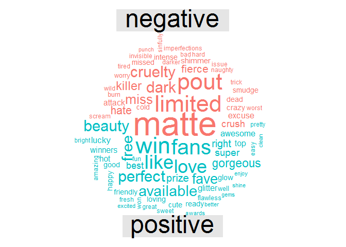

Word cloud for comments.

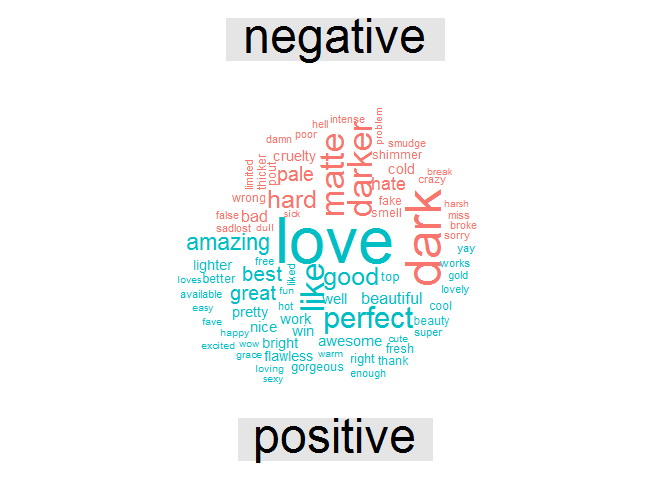

N-gram is a consecutive sequence of words. By setting `n` to 2, pairs of two consecutive words will be created. This can be used to model relationship between them. Bigrams were used to analyze comments and find words, that are most frequently preceded by word 'australis'. The comments were divided into pairs of words, each pair was counted and stop words were removed. To get sentiment, `AFINN` lexicon was used. `ggplot2` was used to plot the results.

These bigrams can show how fans on Facebook perceive the brand. Most words that follow 'australis' in the comments have positive sentiment and therefore the brand seems to be perceived very positively. Out of 30 most frequent bigrams, only three had negative sentiment. Further analysis could reveal more about why people were using negative words in the comments and suggest improvements.

``` r
#dividing comments into bigrams, counting the frequencies
com_bigrams <- comment_df %>%
  unnest_tokens(bigram, text, token = "ngrams", n = 2)

com_bigrams %>%
  count(bigram, sort = TRUE)

#removing stop words
bigrams_separated <- com_bigrams %>%
  separate(bigram, c("word1", "word2"), sep = " ")

bigrams_filtered <- bigrams_separated %>%
  filter(!word1 %in% stop_words$word) %>%
  filter(!word2 %in% stop_words$word)

#new bigram counts:
bigram_counts <- bigrams_filtered %>% 
  count(word1, word2, sort = TRUE)

bigrams_united <- bigrams_filtered %>%
  unite(bigram, word1, word2, sep = " ")

#filtering bigrams that contain 'australis' as the first word
bigrams_separated %>%
  filter(word1 == "australis") %>%
  count(word1, word2, sort = TRUE)

#getting sentiment
AFINN <- get_sentiments("afinn")

aus_words <- bigrams_separated %>%
  filter(word1 == "australis") %>%
  inner_join(AFINN, by = c(word2 = "word")) %>%
  count(word2, score, sort = TRUE) %>%
  ungroup()

#plotting the results
aus_words %>%
  mutate(contribution = n * score) %>%
  arrange(desc(abs(contribution))) %>%
  head(30) %>%
  mutate(word2 = reorder(word2, contribution)) %>%
  ggplot(aes(word2, n * score, fill = n * score > 0)) +
  geom_bar(stat = "identity", show.legend = FALSE) +
  xlab("Words preceded by \"australis\"") +
  ylab("Sentiment score * number of occurrences") +
  coord_flip()
```

    ## # A tibble: 138,206 × 2
    ##     bigram     n
    ##      <chr> <int>
    ## 1     ed u 11094
    ## 2   u 00a0  5553
    ## 3   00a0 u  5547
    ## 4   u 00bd  5143
    ## 5  00bd ed  5038
    ## 6   u 00b8  3190
    ## 7   00b8 u  3163
    ## 8   u 008d  1487
    ## 9   u 00b2  1127
    ## 10  00b2 u  1120
    ## # ... with 138,196 more rows

    ## Source: local data frame [339 x 3]
    ## Groups: word1 [1]
    ## 
    ##        word1      word2     n
    ##        <chr>      <chr> <int>
    ## 1  australis  cosmetics   256
    ## 2  australis   products    56
    ## 3  australis essentials    33
    ## 4  australis         is    33
    ## 5  australis    product    29
    ## 6  australis          i    21
    ## 7  australis     makeup    20
    ## 8  australis       make    17
    ## 9  australis      fresh    15
    ## 10 australis        and    13
    ## # ... with 329 more rows

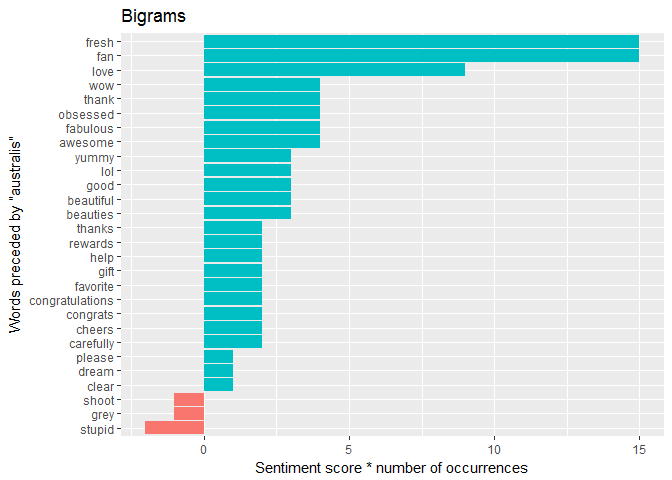

Sentiment analysis and `nrc` package were also used to compare the sentiment in the comments with the corresponding reactions for 'love' and 'wow'. The amount of 'haha', 'sad' and 'angry' reactions was much smaller so these reactions were not compared.

First, a subset of the data frame was created because Facebook introduced reactions in February 2016. Posts posted before February 2016 do not have reactions and therefore were excluded.

``` r
australis_reactions <- australis[1780:2044,]
```

Joy emotion was used to compare the sentiment in the comments with 'love' reaction based on the 'joy' words in the `nrc` package. After getting the sentiment, posts without reactions were removed and the result was plotted using a bar plot.

``` r
#getting sentiment for 'joy' emotion from nrc lexicon
nrcjoy <- get_sentiments("nrc") %>% 
  filter(sentiment == "joy")

#getting sentiment for comments
comments_joy <- comments_s %>%
  inner_join((nrcjoy), by = "word") %>%
  group_by(index = line) %>% 
  count(word, sort = TRUE)

#removing posts without reactions
comments_joy[posts_joy$index>=1780,]

#plotting the result
ggplot(comments_joy, aes(x=comments_joy$index, y=comments_joy$n)) +
  geom_bar(stat = "identity") +
  labs(x = "created time", y = "love count") +
  theme_bw() +
  ggtitle("Joy sentiment in the comments")
```

The second plot shows a distribution of 'love' reactions.

``` r
ggplot(australis_reactions, aes(x=australis_reactions$created_time, y=australis_reactions$love_count)) +
  geom_bar(stat = "identity") +
  labs(x = "created time", y = "love count") +
  theme_bw() +
  ggtitle("The distribution of love reactions")
```

The reactions do not match the sentiment in the comments. This can be a result of an incorrect classification of some words as mentioned earlier. Industry-specific lexicon could improve accuracy of the classification of words such as 'dark', 'matte', 'killer' or 'naughty' which usually have a negative connotation but in this context, they should be viewed differently. 'Matte' and 'dark' are some of the words that most significantly contribute to the negative sentiment in the comments. However, if they were classified as positive, the overall sentiment in the comments might match the reactions better. Moreover, text analysis does not perform well when it comes to interpreting short, less obvious and ambiguous messages that include sarcasm or humor. In cases like this, reactions can be used contextualize the results of text analysis and provide some clarification in situations where the sentiment analysis is not sufficient.

    ## Source: local data frame [595 x 3]
    ## Groups: index [142]
    ## 
    ##    index    word     n
    ##    <int>   <chr> <int>
    ## 1   1833    love   152
    ## 2   1889    love    47
    ## 3   1838    love    37
    ## 4   1843    love    35
    ## 5   1833 perfect    27
    ## 6   1833   cream    19
    ## 7   1983    good    12
    ## 8   1893 perfect    11
    ## 9   1995    good    11
    ## 10  1843   cream    10
    ## # ... with 585 more rows

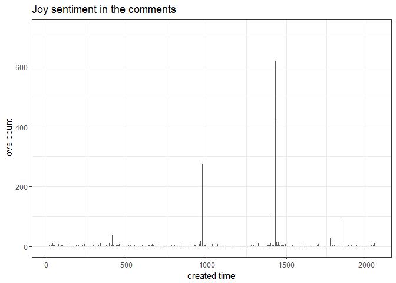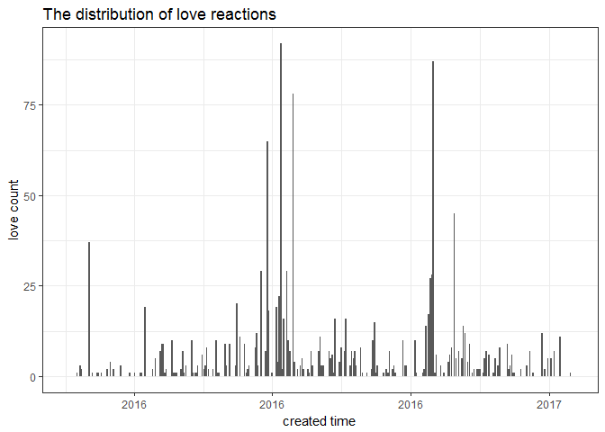

The same process was used to compare 'wow' reactions and 'anticipation' emotion.

``` r
#getting sentiment for 'anticipation' emotion from nrc lexicon
nrcant <- get_sentiments("nrc") %>% 
  filter(sentiment == "anticipation")

#getting sentiment for comments
comments_ant <- comments_s %>%
  inner_join((nrcant), by = "word") %>%
  group_by(index = line) %>% 
  count(word, sort = TRUE)

#removing posts without reactions
comments_ant[comments_ant$index>=1780,]

#plotting the result
ggplot(comments_ant, aes(x=comments_ant$index, y=comments_ant$n)) +
  geom_bar(stat = "identity") +
  labs(x = "created time", y = "wow count") +
  ggtitle("Anticipation sentiment in the comments") +
  theme_bw()

#the distribution of wow reactions
ggplot(australis_reactions, aes(x=australis_reactions$created_time, y=australis_reactions$wow_count)) +
  geom_bar(stat = "identity") +
  labs(x = "created time", y = "wow count") +
  ggtitle("The distribution of wow reactions") +
  theme_bw()
```

Again, the sentiment in the comments does not match the 'wow' reactions.

    ## Source: local data frame [544 x 3]
    ## Groups: index [130]
    ## 
    ##    index    word     n
    ##    <int>   <chr> <int>
    ## 1   1833 perfect    27
    ## 2   1833   cream    19
    ## 3   1833    long    17
    ## 4   1911     top    17
    ## 5   1833    time    12
    ## 6   1983    good    12
    ## 7   1893 perfect    11
    ## 8   1995    good    11
    ## 9   1843   cream    10
    ## 10  1911  pretty    10
    ## # ... with 534 more rows

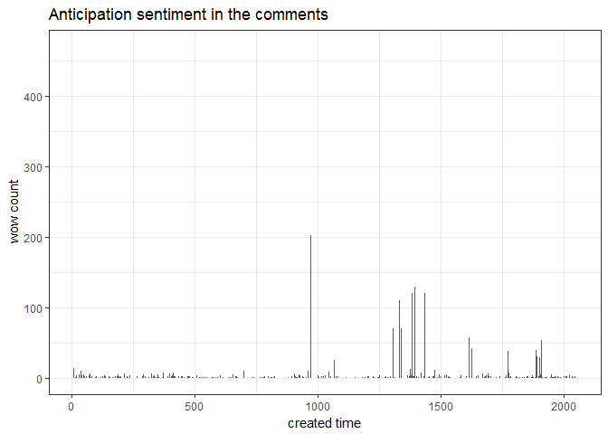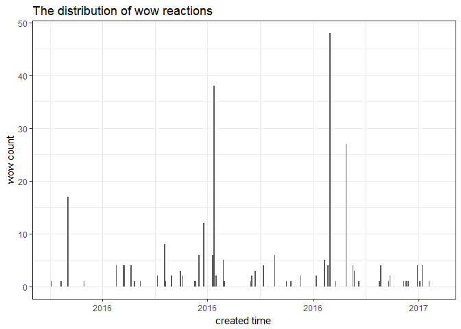

Prediction of Engagement
------------------------

Regression model of random forest algorithm was used to predict the amount of likes for a post. Random forest was used because it avoids the problem of over-fitting that can occur when using a decision tree. Random forest is also suitable for smaller samples.
The data frame was edited - new columns were added. New columns include `weekday` - contains labels with days of week when the post was posted, `hour` - contains hour of when the post was posted and `comlen` - the sum of lengths of comments of each post.

``` r
#creating new columns for day of the week and hour from created_time column
australis$weekday <- wday(australis$created_time, label = TRUE)
australis$hour <- lubridate::hour(australis$created_time)

#adding columns to data frame
comlen <- as.character(australis$comments)
comlen <- nchar(comlen)
australis$comlen <- paste(comlen)
australis$weekday <- paste(australis$weekday)
australis$hour <- paste(australis$hour)
```

`AFINN` lexicon was used again to get the scores of sentiment for comments.

``` r
#splitting the data set into one-term-per-row
australis$comments <- as.character(australis$comments)
comments <- australis$comments
com_df <- data_frame(line = 11:2054,  text = post)
com_s <- com_df %>%
  unnest_tokens(word, text)

#getting the sentiment
afinn2 <- com_s %>% 
  inner_join(get_sentiments("afinn"), by = "word") %>% 
  group_by(index = line) %>% 
  summarise(sentiment = sum(score)) %>% 
  mutate(method = "AFINN")

#creating a new data frame for sentiment and merging it with aistralis data frame
afinn_df2 = data.frame(matrix(NA, nrow=2044, ncol=2))
colnames(afinn_df2) <- c("index", "sentiment")
afinn_df2$index <- 11:2054
afinn_df2 <- merge(x=afinn2, y=afinn_df2,  by = "index", all = TRUE)
afinn_df2[is.na(afinn_df2)] <- 0 

afinn_df2 <- subset(afinn_df2, select = c("sentiment.x"))
afinn_char2 <- as.character(afinn_df2[,1])
australis$afinncom <- afinn_char2
```

A subset of the data frame was created and only includes variables used in a random forest function and id. Character variables were converted to either factor or numeric type. The subset was also divided into train data set used for training the model and test data set to test the model.

``` r
#creating a subset of the data frame
australis$weekday <- as.factor(australis$weekday)
australis$afincomm <- as.factor(australis$afinncom)
australis$comlen <- as.numeric(australis$comlen)
australis$hour <- as.numeric(australis$hour)
australis_train = subset(australis, select=c("id", "likes_count","comments_count", "shares_count", "comments", "comlen", "weekday", "hour", "afinncom"))

#dividing the data set into training & test datasets
 set.seed(666)
 split <- sample(nrow(australis_train), floor(0.7*nrow(australis_train)))
 train <- australis_train[split,]
 test <- australis_train[-split,]
```

Package `randomForest` was used to create random forest. Variables used to predict the amount of likes of a post were the amount of comments and shares, the length of comments, the sentiment of the comments, weekday and hour when the post was posted.

``` r
library(randomForest)

#setting the seed
set.seed(300)

#predicting number of likes
fit <- randomForest(likes_count ~ comments_count + shares_count + comlen + afinncom +
                    weekday + hour,
                    data=train, 
                    importance=TRUE, 
                    mtry = 3,
                    ntree=1000)

print(fit)
importance(fit)
varImpPlot(fit)
plot(fit)
```

Even after experimenting with different values of number of trees (`ntree`) and number of random variables used in each tree (`mtry`), the highest achieved value of explained variance was 46.74%.

    ## 
    ## Call:
    ##  randomForest(formula = likes_count ~ comments_count + shares_count +      comlen + afinncom + weekday + hour, data = train, importance = TRUE,      mtry = 3, ntree = 1000) 
    ##                Type of random forest: regression
    ##                      Number of trees: 1000
    ## No. of variables tried at each split: 3
    ## 
    ##           Mean of squared residuals: 23063.92
    ##                     % Var explained: 46.74

    ##                  %IncMSE IncNodePurity
    ## comments_count 11.650987      10687153
    ## shares_count   44.920456      26122024
    ## comlen          9.502094       8155444
    ## afinncom       15.555064       4387453
    ## weekday         5.611049       3634949
    ## hour            6.123034       3969216

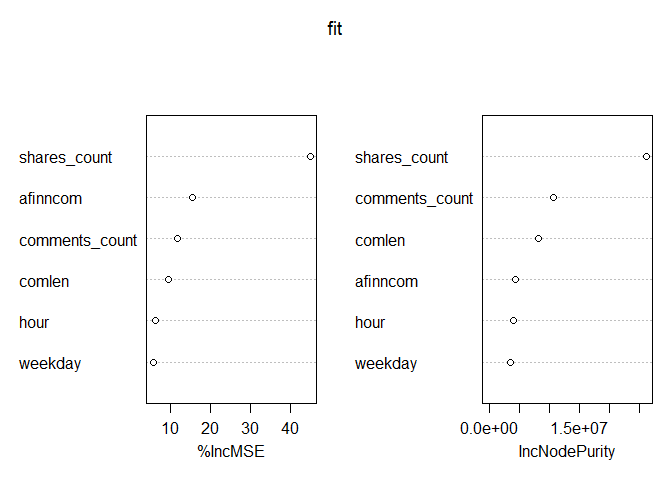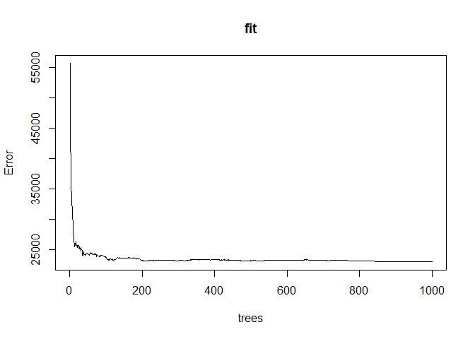

`importance(fit)` and `varImpPlot(fit)` shows the importance of each variable. It is clear that `shares_count` variable has the highest importance in the model. The reason for this could be that the more the post is shared, the more people can view it and engage with it. Moreover, people who are fans of Australis Cosmetics page are likely to have friends who are also interested in make-up and beauty and therefore the posts that are more shared can accumulate more likes.

`plot(fit)` seems to show that there is not a significant reduction in error rate after 300 decision trees.

`predict` function was used for prediction of likes based on the model. Area Under the Curve was calculated using `pROC` package. Multi-class area under the curve is equal to 0.8926 which means that the model is moderately predictive.

``` r
#testing the model and predicting the amount of likes
test$outcome <- predict(fit, test)

#calculating Area Under the Curve
ROC1 <- multiclass.roc(test$likes_count, test$outcome)

AUC1 <- auc(ROC1)
AUC1
```

    ## Multi-class area under the curve: 0.8926

Conclusion
----------

In summary, this report analysed publicly available data collected from the Australis Cosmetics Facebook Page. Exploratory analysis described and visualized information about the distribution of likes, comments, shares and reactions for all posts. Sentiment analysis examined the way page users perceive Australis Cosmetics brand. The results of sentiment analysis can provide answers to questions related to user engagement, reactions to new products and campaigns, brand image etc. These findings can help the company to better understand its customers.

Ideas for Further Research and Recommendations
----------------------------------------------

This report was very limited when it comes to available data. More information regarding the user demographics, reach of the posts and page views could reveal significantly more information and improve the prediction model.

Recommendations:

-   Even though sentiment in the comments is generally very positive, it might be worth examining the comments with negative feedback more closely in order to provide better customer service.

-   Based on exploratory analysis, if the company decides to post a post where it asks users for feedback in the comments section, it might be useful to take into account the time of the day and the day of the week when users are more likely to respond

-   In sentiment analysis, some comments received much higher positive score than others. These posts should also be examined more closely to reveal what evokes such a positive reaction. These findings can be helpful when creating other posts.
