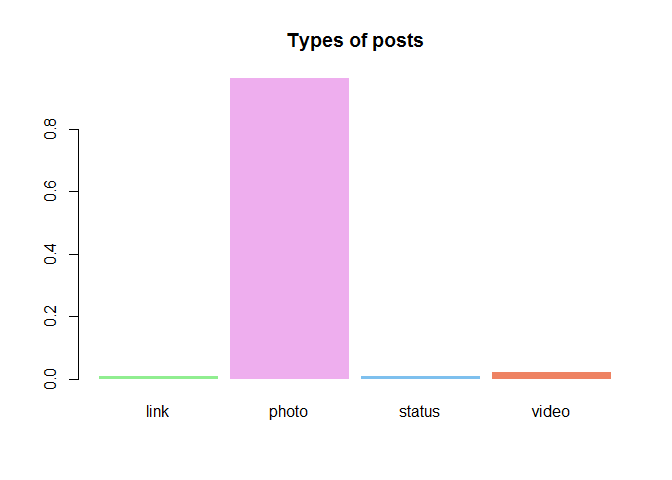
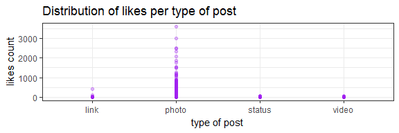
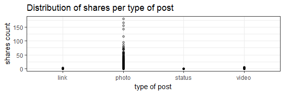
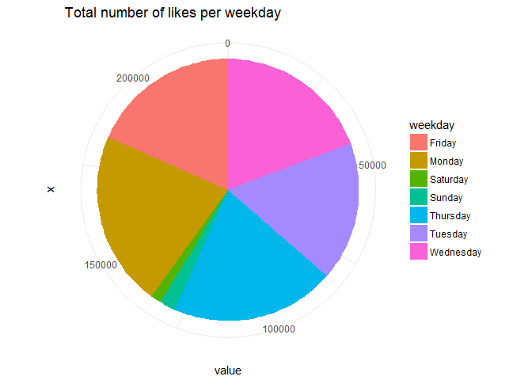

Introduction
------------

Facebook is the most popular social network. With almost 2 billion monthly active users, it contains a large amount of data about users and their behavior.

### User Data

Demographic data that Facebook Page owners can accessed through Facebook Insights provides information such as gender, age and location. Demographic data of users who like a particular Facebook Page used to be available but are not available anymore. Therefore I was not able to access user data for this project.

### Page Data

Rfacebook provides and interface to the Facebook API and after getting the User Access Token from Graph API Explorer, Facebook data can be accessed.

    #loading Rfacebook library
    library(Rfacebook)
    token <- 'XXXXX'

    #getting a data frame containing all posts from Australis Cosmetics Facebook Page and reactions for each post
    australis <- getPage(183675737042, token, n=5000, reactions = T)
    #setting id column as the first column in the data frame
    id <- australis$id[1]

Page data includes a list of posts, likes, reactions, comments and shares.

Data Set
--------

Important information in the data set are the text of the post (message), time when the post was created (created\_time), type of the post (type), counts of likes, comments and shares (likes\_count, comments\_count and shares\_count) and counts of reactions (love\_count, haha\_count,wow\_count, sad\_count and angry\_count).

Another important part of the data set is the text of comments associated with every post. Comment data can be accessed using getPost function and using id column to match a list of comments with the correct post.

    #getting a list of comments for every post
    com <- list()
    for (i in 1:length(australis$id)){
      com[[i]] <- getPost(post=australis$id[i], token, comments = TRUE, likes = FALSE)
    }

The list of comments is later attached to the main data frame.

    #merging australis and com into one data frame
    for(i in 1:length(com)){
      australis$comments[i] <- paste(com[[i]]$comments$message,collapse=" ")
    }

### Limitations of the Data Set

As previously mentioned, the data set does not include any user information due to privacy. Other information that can be accessed through Facebook Insights include the device/platform the likes came from, page views, check-ins, the reach of posts, unlikes or how many page fans are online at any given time of the day. These information are only accessible to page admin and therefore are also not contained in the data set. As a result, this data set cannot answer any user or demographics-related questions and questions regarding the reach of posts or page views.

### Data Cleaning

The data set did not require any major transformations. The time format in the created\_time column, however, needed to be edited. Time zone has been changed to Australian Eastern Daylight Time and three other columns were created that will be used in analysis. These columns are weekday - containing days of the week then the post was posted, month - containing the months and hour - a column containing the hour of when the post was posted.

    library(lubridate)

    australis$created_time <- as.POSIXct(australis$created_time, format = "%Y-%m-%dT%H:%M:%S+0000", tz ="GMT")

    #changing the time zone 
    time <- attr(australis_raw$created_time, "tzone") <- "Australia/Sydney"

    australis$weekday <- wday(australis$created_time, label = TRUE)
    australis$month <- lubridate::month(australis$created_time, label = TRUE)
    australis$hour <- lubridate::hour(australis$created_time)

Preliminary Exploration Analysis
--------------------------------

Preliminary exploratory analysis showed the distribution of likes, comments and shares over time.

Pie chart showing all reactions show that 'love' and 'wow' reactions are most common.

Most of the posts on the page include a photo and therefore the most common type of post is 'photo'.

Consequently, 'photo' as a type of posts received the highest number of likes, comments and shares.

Most posts were posted in the afternoon, smaller number of posts were posted in the morning and in the evening and almost none at night.

    ## 
    ## Attaching package: 'lubridate'

    ## The following object is masked from 'package:base':
    ## 
    ##     date

The amount of posts during the week is evenly distributed with slightly higher number of posts on Friday, and the amount of posts posted during the weekend is significantly lower.

More than a half of the total number of likes belong to posts that were posted in the afternoon, mornings have the second highest amount.

The total number of likes per weekday is evenly distributed and the amount of likes per post posted during the weekend are lower.

